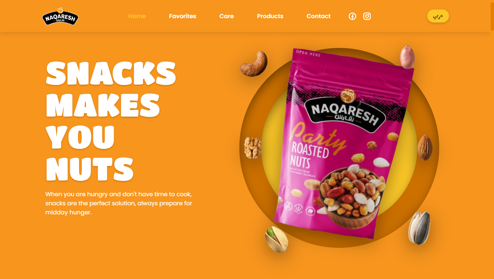
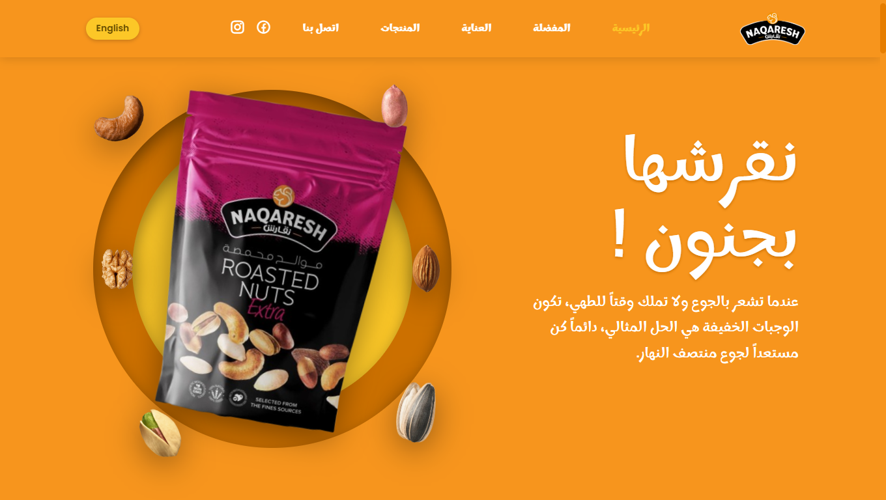

# 🌰 Naqaresh Bilingual Website (Next.js)

This is a **bilingual (English & Arabic) responsive website** for **Naqaresh Snacks**, built with **Next.js**.  
It includes animations, product filtering, and a language toggle system between English and Arabic.

---

## 📖 Features

- ✅ Built with **Next.js** (React + Server-Side Rendering)
- ✅ ESLint + Prettier for consistent code style
- ✅ Husky + lint-staged for **pre-commit checks**
- ✅ Responsive navigation with open/close toggle
- ✅ Scroll animations
- ✅ Product filter by size
- ✅ Automatic product image slideshow on homepage
- ✅ Scroll-up button
- ✅ Active menu highlighting based on scroll
- ✅ **Bilingual support** (English & Arabic) with toggle button
  - Shows `عربي` (Marhey font) on English version → switches to Arabic
  - Shows `English` (Poppins font) on Arabic version → switches to English
- ✅ Arabic version uses **Marhey font** with larger text for readability

---

## ⚙️ Setup

1. Clone or unzip the project files:

   ```bash
   git clone https://github.com/rimarayya/naqaresh-website
   ```

   ```bash
   cd naqaresh-website
   ```

   ```bash
   npm install
   ```

2. Run the development server:

   ```bash
   npm run dev
   ```

   Then open [http://localhost:3000](http://localhost:3000) in your browser.

3. Available scripts:

   ```bash
   npm run dev       # Start dev server
   ```

   ```bash
   npm run build     # Build for production
   ```

   ```bash
   npm run start     # Run production build
   ```

   ```bash
   npm run lint      # Run ESLint checks
   ```

   ```bash
   npm run format    # Run Prettier formatting
   ```

---

## 🧹 Code Quality

This project uses **Husky + lint-staged** to ensure code quality before every commit:

- On commit, all staged files are automatically checked with **ESLint** and **Prettier**.
- If issues are found, the commit is blocked until fixed.

---

## 🌐 Language Toggle

- The language toggle button is located in the navigation bar.
- On **English page** → Button text is `عربي` (Marhey font).
- On **Arabic page** → Button text is `English` (Poppins font).
- Clicking the button switches between English and Arabic content.

---

## 📂 Project Structure

```
NAQARESH/
│── pages/              # Next.js pages (English + Arabic routes)
│── public/             # Static assets (images, fonts, etc.)
│── components/         # React components
│── styles/             # CSS/SCSS files
│── .eslintrc.json      # ESLint config
│── .prettierrc         # Prettier config
│── .eslintignore
│── .prettierignore
│── .gitignore
│── package.json
└── README.md
```

---

## 📷 Screenshots

### English Version



### Arabic Version


